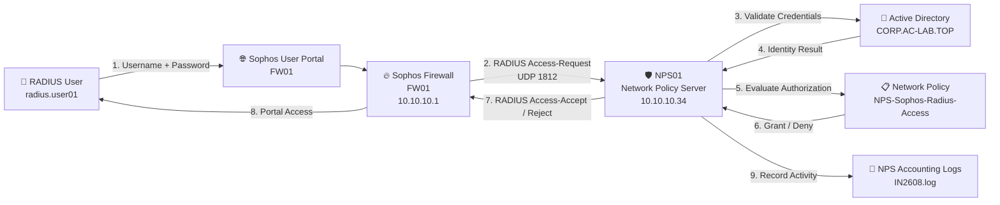

# Volume 19 – Network Policy Server (NPS) / RADIUS


---

## 📌 Overview

This volume deploys **Microsoft Network Policy Server (NPS)** as the centralized **RADIUS server** for the enterprise lab.

NPS was integrated with **Active Directory Domain Services (AD DS)** and connected to the **Sophos Firewall (FW01)** as a RADIUS client.

The deployment demonstrates the three primary RADIUS functions:

- **Authentication** – verify the identity of a user
- **Authorization** – determine whether the authenticated user is permitted access
- **Accounting / Logging** – record RADIUS authentication activity for auditing and troubleshooting

A dedicated Active Directory test account was authenticated from the Sophos Firewall through NPS.

Successful authentication was validated from:

- Sophos RADIUS connectivity testing
- Sophos User Portal
- NPS Event Viewer events
- NPS text accounting logs


---

# 🏗 Architecture



---

# 🔐 RADIUS AAA Model

RADIUS is commonly described using the **AAA model**.

| Function | Purpose | Lab Implementation |
|---|---|---|
| Authentication | Who are you? | Active Directory validates `radius.user01` |
| Authorization | What are you allowed to access? | NPS evaluates `NPS-Sophos-Radius-Access` |
| Accounting | What happened? | NPS records RADIUS activity in local log files |

The authentication flow therefore becomes:

```text
User
  │
  ▼
Sophos Firewall
  │
  │ RADIUS Access-Request
  ▼
NPS01
  │
  ├──── Authentication ────► Active Directory
  │
  ├──── Authorization ─────► NPS Network Policy
  │
  └──── Accounting ────────► NPS Logs
```

---

# 🖥 Infrastructure

| Component | Hostname / Name | Address / Details | Purpose |
|---|---|---|---|
| Active Directory | DC01 | CORP.AC-LAB.TOP | Identity provider |
| NPS Server | NPS01 | 10.10.10.34 | RADIUS server |
| Firewall | FW01 | 10.10.10.1 | RADIUS client / NAS |
| Test User | radius.user01 | Active Directory | RADIUS authentication test |
| NPS Policy | NPS-Sophos-Radius-Access | Processing Order 1 | Authorization policy |
| RADIUS Client | FW01-Sophos | 10.10.10.1 | Sophos Firewall |
| Authentication Port | UDP 1812 | RADIUS | Authentication |
| Accounting Port | UDP 1813 | RADIUS | Accounting |

Domain:

```text
CORP.AC-LAB.TOP
```

NPS FQDN:

```text
NPS01.CORP.AC-LAB.TOP
```

---

# ⚙️ NPS Deployment

The **Network Policy and Access Services / Network Policy Server** role was installed on `NPS01`.

The server was then registered in Active Directory so NPS could read the dial-in and authentication-related properties required to evaluate domain accounts.

The NPS Windows service was validated using:

```powershell
Get-Service IAS
```

Expected and validated state:

```text
Status   Name
------   ----
Running  IAS
```

`IAS` is the Windows service name used by Network Policy Server.

---

# 🏢 Active Directory Integration

NPS was integrated with the existing Active Directory domain:

```text
CORP.AC-LAB.TOP
```

A dedicated test account was used:

```text
Name:              RADIUS User 01
SamAccountName:    radius.user01
UserPrincipalName: radius.user01@CORP.AC-LAB.TOP
Enabled:           True
LockedOut:         False
```

The account was validated with PowerShell:

```powershell
Get-ADUser -Identity "radius.user01" `
-Properties Enabled,SamAccountName,UserPrincipalName,LockedOut |
Select Name,Enabled,SamAccountName,UserPrincipalName,LockedOut
```

This confirmed that the test account:

- existed in Active Directory
- was enabled
- had a valid UPN
- was not locked out

---

# 🔥 Sophos Firewall RADIUS Client

The Sophos Firewall was configured as a **RADIUS client** in NPS.

Configuration:

| Setting | Value |
|---|---|
| Friendly Name | FW01-Sophos |
| Client Address | 10.10.10.1 |
| Vendor | RADIUS Standard |
| Authentication | Shared Secret |

The same shared secret was configured on both:

```text
NPS01
   ↕
Shared Secret
   ↕
FW01
```

The shared secret itself is intentionally **not documented** in the repository.

---

# 🌐 Sophos External Authentication Server

The NPS server was configured in Sophos Firewall as an external RADIUS authentication server.

Configuration:

| Setting | Value |
|---|---|
| Server Type | RADIUS Server |
| Server Name | NPS01 |
| Server IP | 10.10.10.34 |
| Authentication Port | 1812 |
| Group Name Attribute | Filter-Id |
| Shared Secret | Configured |
| Authentication Backend | Microsoft NPS |

The Sophos firewall therefore acts as the **Network Access Server (NAS) / RADIUS client**, while NPS performs centralized authentication and authorization.

---

# 📋 Connection Request Policy

NPS processed incoming requests using:

```text
Use Windows authentication for all users
```

The policy forwards authentication processing to the Windows authentication provider.

Authentication provider:

```text
Windows
```

Authentication server:

```text
NPS01.CORP.AC-LAB.TOP
```

---

# 🛡️ Network Policy

A dedicated Network Policy was created:

```text
NPS-Sophos-Radius-Access
```

Configuration:

| Setting | Value |
|---|---|
| Policy | NPS-Sophos-Radius-Access |
| Status | Enabled |
| Processing Order | 1 |
| Access Type | Grant Access |
| Authentication Provider | Windows |
| Authentication Method | PAP |

The dedicated policy appears above the built-in deny policies:

```text
1       NPS-Sophos-Radius-Access              Grant Access
999998  Connections to Microsoft Routing...   Deny Access
999999  Connections to other access servers   Deny Access
```

This ordering ensures the intended Sophos RADIUS request is evaluated by the dedicated access policy before the default deny policies.

---

# 🔑 Authentication Method

The working Sophos/NPS authentication request used:

```text
PAP
```

NPS Event Viewer confirmed:

```text
Authentication Type: PAP
```

PAP was used for this controlled lab integration between Sophos Firewall and NPS.

> **Security note:** PAP does not itself provide strong credential protection. In production environments, the transport and authentication design must be carefully secured, and stronger certificate/EAP-based methods should be considered where supported.

This lab establishes the RADIUS infrastructure required for later enterprise authentication scenarios.

---

# 🧪 Initial Authentication Failure

During initial testing, Sophos successfully reached NPS, but authentication failed.

NPS recorded:

```text
Network Policy Server denied access to a user.
```

The request contained:

```text
Account Name: CORP\radius.user01
RADIUS Client: FW01-Sophos
Client IP Address: 10.10.10.1
Authentication Type: PAP
Reason Code: 16
```

Reason:

```text
Authentication failed due to a user credentials mismatch.
Either the user name provided does not map to an existing
user account or the password was incorrect.
```

This was important because it proved several components were **already functioning**:

```text
Sophos
   │
   │ UDP 1812
   ▼
NPS01
   │
   ▼
Request processed
```

The problem was therefore no longer basic RADIUS connectivity.

---

# 🔎 Troubleshooting the AD Account

The Active Directory account was checked directly:

```powershell
Get-ADUser -Identity "radius.user01" `
-Properties Enabled,SamAccountName,UserPrincipalName,LockedOut |
Select Name,Enabled,SamAccountName,UserPrincipalName,LockedOut
```

Result:

```text
Name              : RADIUS User 01
Enabled           : True
SamAccountName    : radius.user01
UserPrincipalName : radius.user01@CORP.AC-LAB.TOP
LockedOut         : False
```

This eliminated:

- disabled account
- missing account
- account lockout
- incorrect UPN configuration

as likely causes.

---

# ✅ Successful RADIUS Authentication

Authentication was successfully completed using the Active Directory UPN:

```text
radius.user01@CORP.AC-LAB.TOP
```

Sophos reported:

```text
Device-RADIUS server connectivity test was successful
```

NPS simultaneously recorded:

```text
Network Policy Server granted access to a user.
```

Important details:

```text
Security ID:
CORP\radius.user01

Account Name:
radius.user01@CORP.AC-LAB.TOP

Account Domain:
CORP

RADIUS Client:
FW01-Sophos

Client IP Address:
10.10.10.1

Connection Request Policy:
Use Windows authentication for all users

Network Policy:
NPS-Sophos-Radius-Access

Authentication Provider:
Windows

Authentication Server:
NPS01.CORP.AC-LAB.TOP

Authentication Type:
PAP
```

This confirmed the complete RADIUS authentication chain.

---

# 🌐 Real Sophos User Portal Validation

Testing was extended beyond Sophos' built-in **Test Connection** function.

The Sophos User Portal was enabled on the LAN interface.

The configured Sophos management/portal ports were:

| Service | Port |
|---|---:|
| Admin Console | 4444 |
| User Portal | 4443 |
| VPN Portal | 443 |

The User Portal was therefore accessed using:

```text
https://fw01:4443
```

The RADIUS-backed account:

```text
radius.user01
```

successfully authenticated to the Sophos User Portal.

After authentication, Sophos displayed:

```text
User portal for radius.user01
```

This was an important validation because it proved RADIUS authentication worked through a **real application authentication workflow**, not only through a connectivity test.

---

# 💡 RADIUS vs Application Authorization

An important concept demonstrated during this deployment is the difference between:

```text
Identity Authentication
```

and:

```text
Application Permissions
```

RADIUS can centrally authenticate the user, but the application using RADIUS can still control what that authenticated identity is allowed to do.

For example:

```text
              RADIUS / NPS
                  │
           "Who is this user?"
                  │
                  ▼
            radius.user01
                  │
         Authentication OK
                  │
        ┌─────────┴─────────┐
        ▼                   ▼
     Sophos              Proxmox
        │                   │
   Portal Rights        VM Permissions
```

NPS does not automatically grant RDP, VM administration, firewall administration, or other application privileges.

The service consuming RADIUS determines the final application-level permissions.

This separation allows organizations to centralize authentication while retaining granular authorization inside individual platforms.

---

# 📊 RADIUS Accounting and Logging

NPS accounting was configured to write local text logs.

Log directory:

```text
C:\Windows\System32\LogFiles
```

The active log observed during testing was:

```text
IN2608.log
```

The log directory was validated using:

```powershell
Get-ChildItem C:\Windows\System32\LogFiles
```

The NPS log was inspected using:

```powershell
Get-Content C:\Windows\System32\LogFiles\IN2608.log -Tail 30
```

The log contained both failed and successful RADIUS requests.

---

# 📄 Failed Request in Accounting Log

An earlier failed request appeared as:

```text
CORP\\radius.user01
```

with a failure record containing:

```text
16
```

This corresponded with the Event Viewer authentication failure where NPS reported **Reason Code 16**.

Event Viewer provided the clearer human-readable explanation:

```text
Authentication failed due to a user credentials mismatch.
```

---

# 📄 Successful Request in Accounting Log

Later requests showed successful processing of:

```text
radius.user01
```

and:

```text
radius.user01@corp.ac-lab.top
```

through:

```text
NPS-Sophos-Radius-Access
```

Example successful request information:

```text
User:
radius.user01

Active Directory Object:
CORP.AC-LAB.TOP/Users/RADIUS User 01

RADIUS Client:
FW01-Sophos

RADIUS Client IP:
10.10.10.1

Network Policy:
NPS-Sophos-Radius-Access

Connection Request Policy:
Use Windows authentication for all users
```

This demonstrates that NPS maintains an audit trail of RADIUS authentication activity.

---

# 📡 RADIUS Port Validation

The listening UDP endpoints on NPS01 were validated with:

```powershell
Get-NetUDPEndpoint |
Where-Object {$_.LocalPort -in 1812,1813} |
Select LocalAddress,LocalPort,OwningProcess
```

Result:

```text
LocalAddress                     LocalPort   OwningProcess
------------                     ---------   -------------
fe80::8984:bac2:efe1:3eb7%3      1813        4084
::ffff:10.10.10.34               1813        4084
fe80::8984:bac2:efe1:3eb7%3      1812        4084
::ffff:10.10.10.34               1812        4084
```

This confirms NPS was listening on:

```text
UDP 1812 → RADIUS Authentication
UDP 1813 → RADIUS Accounting
```

Both ports were owned by the same NPS-related process during validation.

---

# 🔄 Complete Authentication Flow

The validated authentication process is:

```text
┌─────────────────────────────┐
│       radius.user01         │
│   Active Directory User     │
└──────────────┬──────────────┘
               │
               │ Login
               ▼
┌─────────────────────────────┐
│       Sophos FW01           │
│       10.10.10.1            │
│                             │
│ RADIUS Client / NAS         │
└──────────────┬──────────────┘
               │
               │ Access-Request
               │ UDP 1812
               ▼
┌─────────────────────────────┐
│          NPS01              │
│       10.10.10.34           │
│                             │
│ Network Policy Server       │
└──────────────┬──────────────┘
               │
       ┌───────┴────────┐
       │                │
       ▼                ▼
┌─────────────┐   ┌───────────────────────┐
│ Active      │   │ NPS Network Policy    │
│ Directory   │   │                       │
│             │   │ NPS-Sophos-           │
│ Validate    │   │ Radius-Access         │
│ Identity    │   │                       │
└──────┬──────┘   └──────────┬────────────┘
       │                     │
       └──────────┬──────────┘
                  │
                  ▼
          Access-Accept
                  │
                  ▼
┌─────────────────────────────┐
│       Sophos FW01           │
│                             │
│ Authentication Successful   │
└──────────────┬──────────────┘
               │
               ▼
        User Portal Access

                  +
                  │
                  ▼
┌─────────────────────────────┐
│      NPS Accounting         │
│                             │
│ IN2608.log                  │
│ Event Viewer                │
└─────────────────────────────┘
```

---

# 🔍 Troubleshooting Summary

Several useful troubleshooting scenarios occurred during the deployment.

| Problem | Finding | Resolution / Result |
|---|---|---|
| RADIUS authentication initially failed | NPS Reason Code 16 | Verified AD account and credentials/username format |
| AD account suspected | Account existed, enabled and unlocked | AD account health confirmed |
| Sophos → NPS connectivity questioned | NPS received requests from `10.10.10.1` | Network path and shared RADIUS configuration validated |
| Sophos Test Connection initially failed | Authentication request reached NPS but credentials were rejected | Correct credentials/UPN successfully authenticated |
| `https://10.10.10.1` did not respond | TCP 443 was not the User Portal | Identified Sophos User Portal as HTTPS 4443 |
| User Portal accessibility questioned | LAN User Portal access already enabled | Connected using `https://fw01:4443` |
| Portal login initially appeared unsuccessful | NPS showed Access-Accept | Authentication path verified and subsequent portal access succeeded |
| Accounting visibility | NPS text logging already enabled | Verified `IN2608.log` |
| RADIUS ports | Needed confirmation that NPS was listening | UDP 1812 and 1813 verified |

---

# 🧠 Key Lessons

## RADIUS is not an application permission system

RADIUS primarily provides centralized AAA services.

A RADIUS-authenticated user does not automatically gain:

- Remote Desktop access
- Proxmox administrative rights
- Sophos administrative rights
- Server administrator privileges
- Application permissions

Those permissions remain controlled by the target service.

---

## The firewall is the RADIUS client

The user workstation is **not** the RADIUS client in this design.

The actual flow is:

```text
User
   ↓
Sophos
   ↓
NPS
   ↓
Active Directory
```

Therefore NPS correctly identifies:

```text
RADIUS Client Friendly Name:
FW01-Sophos

RADIUS Client IP:
10.10.10.1
```

---

## RADIUS centralizes identity

Without RADIUS, each infrastructure platform may require its own local user database:

```text
Sophos   → Local User
VPN      → Local User
Switch   → Local User
Wi-Fi    → Local User
Proxmox  → Local User
```

With centralized authentication:

```text
                    Active Directory
                           ▲
                           │
                          NPS
                           ▲
             ┌─────────────┼─────────────┐
             │             │             │
          Sophos         VPN          Network
                                      Devices
```

This reduces duplicated credentials and centralizes authentication decisions.

---

# 🔒 Security Considerations

The following security principles were applied or identified during this volume:

- RADIUS shared secrets are not stored in Git
- NPS is domain integrated
- Authentication activity is logged
- Authorization is controlled through NPS policies
- Default deny policies remain below the dedicated allow policy
- Dedicated test identities are used instead of administrator accounts
- RADIUS traffic is limited to known clients
- Authentication failures are auditable
- Application authorization remains separate from identity authentication

For future production-style deployments, certificate-based authentication such as **PEAP/EAP-TLS** should be considered where supported.

The existing enterprise PKI deployed in **Volume 18 – Active Directory Certificate Services** provides a foundation for future certificate-based authentication.

---

# 🚀 Future Expansion

The NPS infrastructure can later support additional enterprise authentication scenarios such as:

```text
802.1X Wired Authentication
802.1X Wireless Authentication
Enterprise Wi-Fi
VPN Authentication
Network Switch Authentication
Firewall Authentication
Other RADIUS-capable Infrastructure
```

Future authentication architecture could use:

```text
Client
   │
   │ 802.1X
   ▼
Switch / Wireless AP
   │
   │ RADIUS
   ▼
NPS01
   │
   │ EAP-TLS
   ▼
Active Directory + Enterprise PKI
```

This creates a path toward certificate-based network access control.

---

# 🩺 Validation Summary

| Validation | Result |
|---|---|
| NPS role installed | ✅ |
| NPS registered with Active Directory | ✅ |
| IAS/NPS service running | ✅ |
| Sophos configured as RADIUS client | ✅ |
| Shared secret configured | ✅ |
| Connection Request Policy configured | ✅ |
| Network Policy configured | ✅ |
| `NPS-Sophos-Radius-Access` enabled | ✅ |
| Processing order verified | ✅ |
| PAP authentication tested | ✅ |
| Active Directory account validated | ✅ |
| Failed authentication observed | ✅ |
| Successful authentication observed | ✅ |
| Sophos RADIUS test successful | ✅ |
| NPS Access-Accept recorded | ✅ |
| Sophos User Portal authentication validated | ✅ |
| NPS accounting/logging validated | ✅ |
| UDP 1812 listening | ✅ |
| UDP 1813 listening | ✅ |
| Authentication logs reviewed | ✅ |
| Enterprise access path validated | ✅ |

---

# 📸 Evidence

Recommended screenshots for this volume:

```text
screenshots/
├── 01-nps-role-installed.png
├── 02-nps-registered-active-directory.png
├── 03-radius-client-fw01-sophos.png
├── 04-connection-request-policy.png
├── 05-network-policy-nps-sophos-radius-access.png
├── 06-authentication-method-pap.png
├── 07-sophos-radius-server-nps01.png
├── 08-radius-test-success.png
├── 09-nps-access-granted-event.png
├── 10-sophos-user-portal.png
├── 11-radius-user-portal-authenticated.png
├── 12-nps-accounting-configuration.png
├── 13-nps-accounting-log.png
└── 14-radius-udp-ports-validation.png
```

> Screenshot filenames can be adjusted to match the actual files stored in the repository.

---

# 📦 Deliverables

This volume delivers:

- ✅ Microsoft Network Policy Server
- ✅ Enterprise RADIUS server
- ✅ Active Directory-integrated authentication
- ✅ Sophos Firewall RADIUS integration
- ✅ Centralized authentication
- ✅ Network Policy authorization
- ✅ RADIUS authentication testing
- ✅ Successful Access-Accept validation
- ✅ Failed authentication troubleshooting
- ✅ Sophos User Portal RADIUS authentication
- ✅ NPS accounting and logging
- ✅ Authentication audit trail
- ✅ RADIUS UDP port validation
- ✅ Foundation for future 802.1X / wireless authentication

---

# ✅ Volume 19 Status

**Volume 19 – Network Policy Server (NPS): COMPLETE**

The enterprise lab now contains a functioning Microsoft RADIUS infrastructure integrated with Active Directory and Sophos Firewall.

The deployment successfully demonstrates:

```text
Authentication
      +
Authorization
      +
Accounting
      =
RADIUS AAA
```

The complete tested path is:

```text
Active Directory User
        ↓
Sophos Firewall
        ↓
RADIUS Access-Request
        ↓
Microsoft NPS
        ↓
Active Directory Authentication
        ↓
NPS Authorization Policy
        ↓
RADIUS Access-Accept
        ↓
Sophos User Portal
        ↓
Accounting / Audit Logs
```

---

## ➡️ Next Volume

**Volume 20 – Remote Desktop Services (RDS)**

The next phase will deploy Microsoft Remote Desktop Services to provide centralized remote administration and application delivery within the enterprise lab.